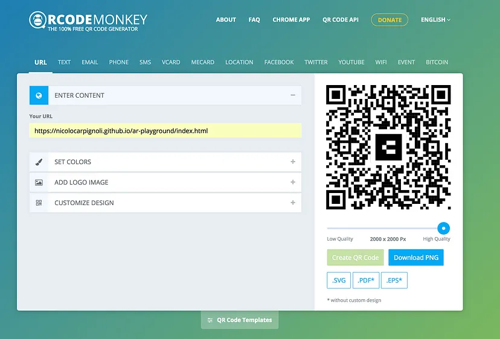

<!-- AR Project  -->
# AR Project

## Description
This is a project for the course "Augmented Reality" at the University of Applied Sciences in Potsdam. The project is about the development of an augmented reality application for the Android platform. The application should be able to recognize a marker and display a 3D model on top of it. The 3D model should be able to be moved and rotated by the user. The application should also be able to recognize a second marker and display a 2D image on top of it. The 2D image should be able to be moved and rotated by the user. The application should also be able to recognize a third marker and display a 3D model on top of it. The 3D model should be able to be moved and rotated by the user. The application should also be able to recognize a fourth marker and display a 2D image on top of it. The 2D image should be able to be moved and rotated by the user. The application should also be able to recognize a fifth marker and display a 3D model on top of it. The 3D model should be able to be moved and rotated by the user. The application should also be able to recognize a sixth marker and display a 2D image on top of it. The 2D image should be able to be moved and rotated by the user. The application should also be able to recognize a seventh marker and display a 3D model on top of it. The 3D model should be able to be moved and rotated by the user. The application should also be able to recognize a eighth marker and display a 2D image on top of it. The 2D image should be able to be moved and rotated by the user. The application should also be able to recognize a ninth marker and display a 3D model on top of it. The 3D model should be able to be moved and rotated by the user. The application should also be able to recognize a tenth marker and display a 2D image on top of it. The 2D image should be able to be moved and rotated by the user. The application should also be able to recognize a eleventh marker and display a 3D model on top of it. The 3D model should be able to be moved and rotated by the user. The application should also be able to recognize a twelfth marker and display a 2D image on top of it. The 2D image should be able to be moved and rotated by the user. The application should also be able to recognize a thirteenth marker and display a 3D model on top of it. The 3D model should be able to be moved and rotated by the user. The application should also be able to recognize a fourteenth marker and display a 2D image on top of it. The 2D image should be able to be moved and rotated by the user. The application should also be able to recognize a fifteenth marker and display a 3D model on top of it. The 3D model should be able to be moved and rotated by the user. The application should also be able to recognize a sixteenth marker and display a 2D image on top of it. The 2D image should be able to be moved and rotated by the user. The application should also be able to recognize a seventeenth marker and display a 3D model on top of it. The 3D model should be able to be moved and rotated by the user. The application should also be able to recognize a eighteenth marker and display a 2D image on top of it. The 2D image should be able to be moved and rotated by the user. The application should also be able to recognize a nineteenth marker and display a 3D model on top of it. The 3D model should be able to be moved and rotated by the user. The application should also be able to recognize a twentieth marker and display a 2D image on top of it. The 2D image should be able to be moved and rotated by the user. The application should also be able to recognize a twenty-first marker and display a 3D model on top of it. The 3D model should be able to be moved and rotated by the user. The application should also be able to recognize a twenty-second marker and display a 2D image on top of it. The 2D image should be able to be moved and rotated by the user. The application should also be able to recognize a twenty-third marker and display a 3D model on top of it. The 3D model should be able to be moved and rotated by the user. The application should also be able to recognize a twenty-fourth marker and display a 2D image on top of it.

## image
